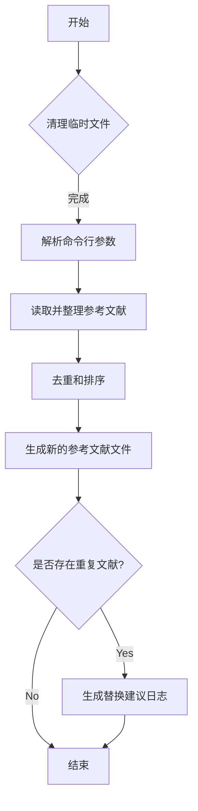

# Reference_Deduplication
Simple tool for document deduplication

# 代码解释
该代码的主要功能是清理指定目录下的临时文件，并对参考文献进行去重、排序和格式化处理，最终生成新的参考文献文件和日志文件。具体逻辑如下：
1. 清理当前目录下以 `.bbl`, `.out`, `.toc`, `.blg`, `.aux` 结尾的临时文件。
2. 解析命令行参数，获取输入路径和输出文件名。
3. 读取并整理参考文献列表，替换部分类型（如将 `@misc` 替换为 `@techreport`）。
4. 对参考文献按标题去重，并生成新的参考文献文件。
5. 如果存在重复的参考文献，生成需要替换的建议日志文件。

# 控制流图


# 执行命令

```bash
# 单文件处理
python 文献处理.py --input_file_or_path=prereferences.bib --output_file=references.bib
# 文件夹所有文件处理
python 文献处理.py --input_file_or_path=references_dir --output_file=references.bib
```

# 附: 好用的文献查询网站

https://dblp.uni-trier.de/search
https://dblp.org/

